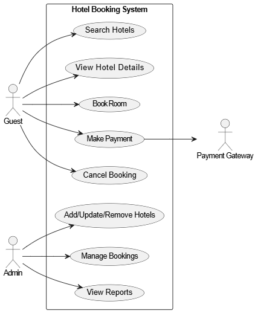

# Requirement Analysis in Software Development

## Introduction  
This repository explores **Requirement Analysis in Software Development**, its role in the Software Development Lifecycle (SDLC), and its importance in building high-quality software.  
The project uses a **hotel booking management system (similar to Airbnb)** as an example case study to illustrate requirement types, use case diagrams, and acceptance criteria.  

---

## What is Requirement Analysis?  
Requirement Analysis is the process of **identifying, documenting, and validating the needs and expectations of stakeholders** for a software system. It is one of the most critical steps in the SDLC because it ensures that the final product aligns with user needs and business goals.  

It helps bridge the gap between stakeholders and developers, reducing misunderstandings and minimizing costly rework later in the project lifecycle.  

---

## Why is Requirement Analysis Important?  

1. **Clarity of Scope**  
   - Prevents scope creep by ensuring all stakeholders agree on what the software should and should not do.  

2. **Cost and Time Efficiency**  
   - Identifying and fixing requirement issues early reduces the risk of expensive changes during later phases of development.  

3. **Improved Communication**  
   - Provides a clear understanding between developers, designers, testers, and stakeholders, ensuring alignment on goals.  

---

## Key Activities in Requirement Analysis  

- **Requirement Gathering**  
  Collecting requirements from stakeholders, clients, and end-users through interviews, surveys, and observations.  

- **Requirement Elicitation**  
  Extracting the actual needs of stakeholders by asking questions, brainstorming, and using workshops.  

- **Requirement Documentation**  
  Recording requirements in a structured format (such as Software Requirement Specification - SRS).  

- **Requirement Analysis and Modeling**  
  Examining requirements for feasibility, consistency, and completeness, often represented through models and diagrams.  

- **Requirement Validation**  
  Ensuring that documented requirements accurately represent the intended system functionality.  

---

## Types of Requirements  

### 1. Functional Requirements  
Define **what the system should do**. These are the core features and functions.  

**Examples (Hotel Booking System):**  
- Users can **search for available hotels** based on location and date.  
- Users can **book a room** and make payments online.  
- Admins can **manage listings**, including adding, updating, or removing hotels.  

### 2. Non-functional Requirements  
Define **how the system performs** its functions. These focus on system attributes like performance, security, and usability.  

**Examples (Hotel Booking System):**  
- The system must **handle up to 10,000 concurrent users** without crashing.  
- Pages must **load within 2 seconds** under normal load.  
- User data and transactions must be **encrypted** for security.  

---

## Use Case Diagrams  

**Use Case Diagrams** visually represent the interaction between **actors (users, admins, systems)** and **use cases (functionalities)**.  

**Benefits:**  
- Simplifies complex systems by showing how different users interact with the application.  
- Provides a clear overview of system functionality.  
- Helps in requirement validation by mapping functions to users.  

**Booking System Use Case Diagram:**  

 

---

## Acceptance Criteria  

**Importance:**  
Acceptance Criteria define the **conditions a software feature must meet** to be accepted by stakeholders. They act as a checklist that ensures requirements are met and the feature works as expected.  

**Example (Checkout Feature – Hotel Booking System):**  
- Users must be able to view their **booking summary** before payment.  
- Users must be able to **select a payment method** (credit card, PayPal, etc.).  
- The system must **send a confirmation email** after successful payment.  
- Payment must be **processed securely** through a trusted gateway.  

